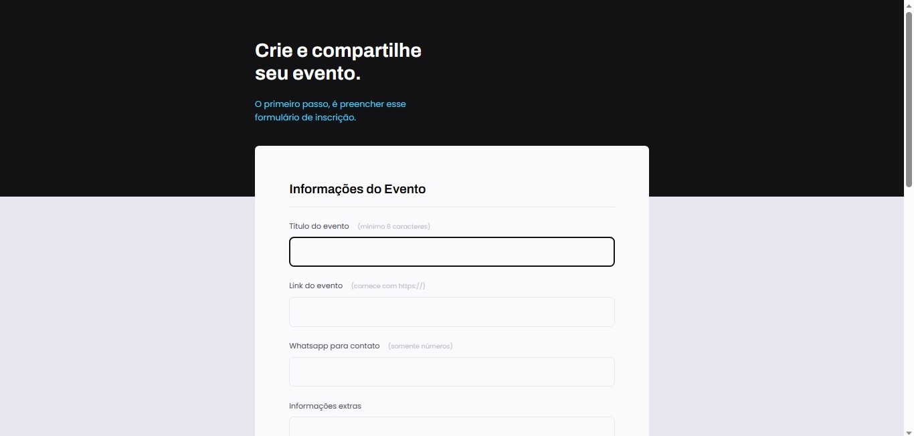

# Formulário_etapa01_Realizado em Aula (Stage 03)

## 🚀 Tecnologias e ferramentas

Esse projeto foi desenvolvido com as seguintes tecnologias:

- HTML e CSS
- Figma
- VSCode
- Git e Github

## 💻 Projeto

O Projeto é um preenchimento de formulário.

## 📝 Aprendizado

 Entendi os campos de HTML, simulando a busca do Google. Iniciei a estrutura do HTML e configurei o VSCode. Iniciei os estilos da página agrupando campos com fieldset e legend. Formatei o campo de texto e ajustar novos campos dentro do fieldset. Estilizei o campo select, aplicando estilos aos agrupamentos restantes. Aprendi como customizar Checkbox com acessibilidade. Criar estilos para submit, validando campos e submetendo formulários. 

💡 Aprendizado pela Rocketseat! 💡
